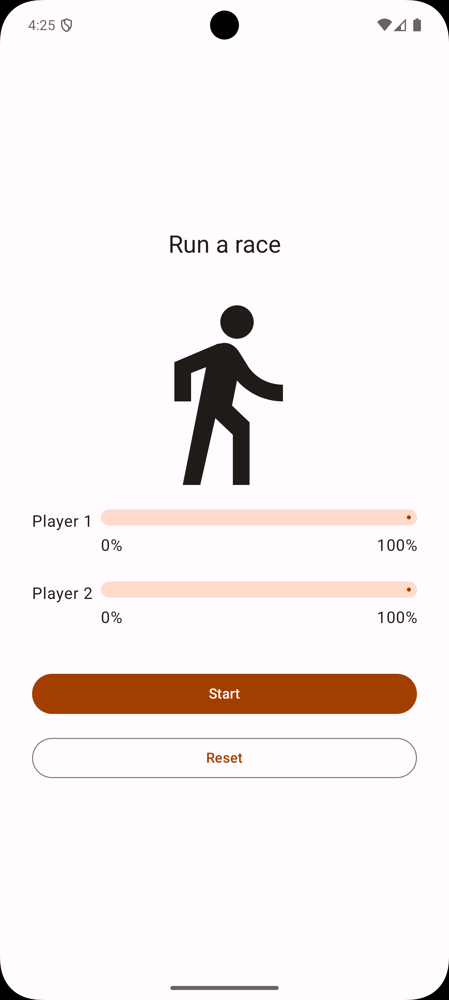
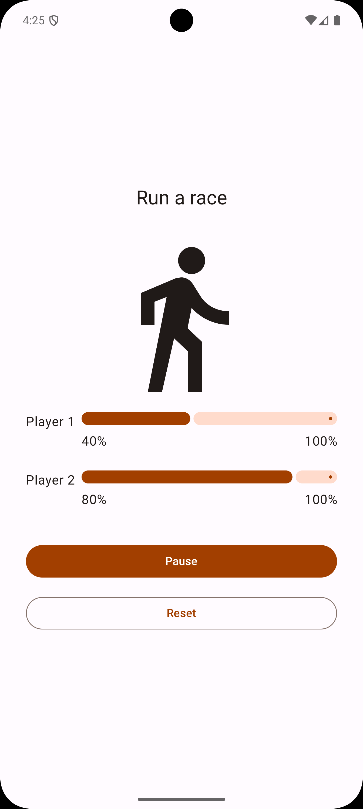

# 🏃‍♂️ Race Tracker App

> A fun and simple Jetpack Compose app to practice **concurrency** in Kotlin.  
Two participants race against each other, and their progress is tracked with clean Compose UI components.

---

## ✨ Features

- **Asynchronous Race Simulation**  
  Each participant (`RaceParticipant`) runs concurrently using coroutines (`launch` inside `LaunchedEffect`).

- **Jetpack Compose UI**
    - Clean, declarative UI with `Column`, `Row`, `LinearProgressIndicator`, and Material 3 components.
    - Adaptive spacing and layout with `dimensionResource`.

- **Race Controls**
    - Start / Pause the race.
    - Reset progress for both players.

- **Concurrency in Action**  
  Both players’ progress updates independently, showcasing coroutine-based concurrent execution.

---

## 📸 Screenshots

| Race Screen | Progress Indicators |
|:-----------:|:------------------:|
|  |  |

---

## ⚙️ Tech Stack

- **Language:** Kotlin
- **UI:** Jetpack Compose, Material 3
- **Concurrency:** Kotlin Coroutines
- **Other:** State handling with `remember` and `LaunchedEffect`